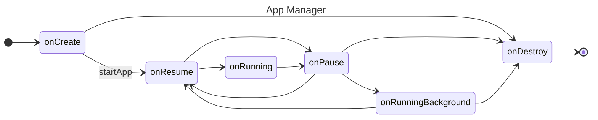

# Crisp

An app lifetime manager like Android **Activity**. This is a lite version, designed for embedded system.

_**Still Working on it ...**_



## Usage

```bash
git submodule init
git submodule update --recursive
```

```bash
# open tests
cmake -B build -DCRISP_BUILD_TESTS=ON -DCMAKE_BUILD_TYPE=Debug
```
